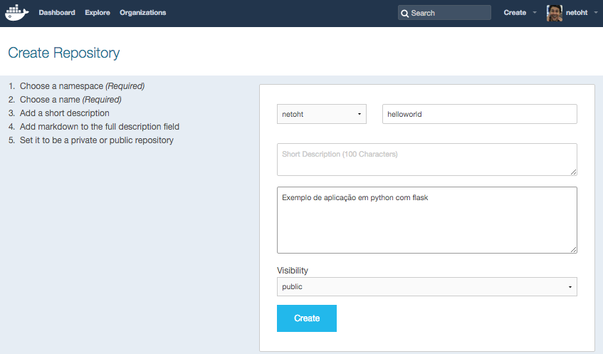

## Instalando o Docker

###### - Linux

```sh
curl -sSL https://get.docker.com/ | sh
sudo usermod -aG docker ubuntu
```

###### - Mac ou Windows

Acesse o endereço: [Docker Toolbox](https://github.com/docker/toolbox/releases/latest)

Baixe o arquivo:

- `DockerToolbox-x.x.x.pkg` **(Mac)**
- `DockerToolbox-x.x.x.exe` **(Windows)**

No terminal configure o acesso ao host

```sh
# Iniciando a máquina virtual
docker-machine start default

# Descobrindo o ip da máquina virtual
export DOCKER_HOST=tcp://$(docker-machine ip default):2376
export DOCKER_CERT_PATH=$HOME/.docker/machine/machines/default
export DOCKER_TLS_VERIFY=1
```

## Testando a instalação do Docker

```sh
docker run hello-world
```

Saída:

```
Hello from Docker.
This message shows that your installation appears to be working correctly.
...
..
.
```

Se você viu essa mensagem na saída então seu docker foi instalado corretamente! :)

## Listando imagens baixadas

```sh
docker images
```

Saída:

```
REPOSITORY          TAG                 IMAGE ID            CREATED             VIRTUAL SIZE
hello-world         latest              0a6ba66e537a        5 weeks ago         960 B
ubuntu              latest              cdd474520b8c        6 weeks ago         188 MB
...
..
.
```


## Buscando por imagens no registry

```sh
docker search centos
```

Saída:

```
NAME                                        DESCRIPTION                                     STARS     OFFICIAL   AUTOMATED
centos                                      The official build of CentOS.                   1644      [OK]
jdeathe/centos-ssh                          CentOS-6 6.6 x86_64 / EPEL/IUS Repos / Ope...   11                   [OK]
blalor/centos                               Bare-bones base CentOS 6.5 image                9                    [OK]
million12/centos-supervisor                 Base CentOS-7 with supervisord launcher, h...   7                    [OK]
nimmis/java-centos                          This is docker images of CentOS 7 with dif...   7                    [OK]
torusware/speedus-centos                    Always updated official CentOS docker imag...   7                    [OK]
nathonfowlie/centos-jre                     Latest CentOS image with the JRE pre-insta...   3                    [OK]
...
..
.
```

## Baixando uma imagem

```sh
docker pull centos
```

Saída:

```
Using default tag: latest
latest: Pulling from library/centos
fa5be2806d4c: Pull complete
0cd86ce0a197: Downloading [==========================>                        ] 33.51 MB/62.91 MB
e9407f1d4b65: Download complete
c9853740aa05: Download complete
e9fa5d3a0d0e: Download complete
...
..
.
```

## Criando sua própria imagem

1. Faça o download deste repositório [download](https://github.com/netoht/docker-helloworld/archive/master.zip)
1. Entre no diretório baixado

```sh
# Construindo a imagem
docker build -t <hub-user>/helloworld:latest .

# Iniciando um container com a sua imagem
docker run -d -p 8080:5000 -h myserver-1 --name server1 <hub-user>/helloworld:latest
```

Parâmetros do comando `docker run`:

- `-d`: o processo irá rodar em background
- `-p`: está redirecionando a porta `8080` do host para a porta `5000` do container
- `-h`: nome do host do container
- `--name`: nome do container

## Compartilhando sua imagem no Docker Hub

1. Acesse o [Docker Hub](http://hub.docker.com)
2. Faça o login
3. Clique em `Menu` > `Create Repository`
4. Preencha as informações de acordo com a imagem abaixo e clique em `Create`:



5\. No terminal:

```sh
# Logando via terminal
docker login

# Enviando nossa imagem para o Docker Hub
docker push <hub-user>/helloworld:latest
```